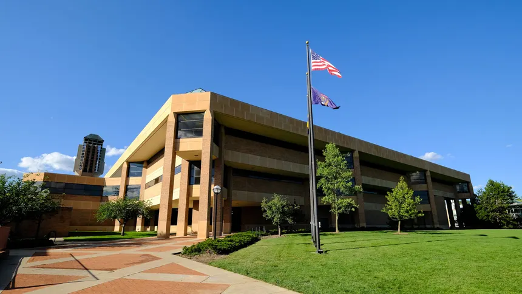

I've been at Ann Arbor for 6 weeks now! Time really flew by I have no idea how tomorrow is October. Here are a few things I've noticed within the school itself especially compared to going to school like UIC specifically in Chicago. 

- There are student org events on weekends! and people show up(?) - this was a huge change from a commuter school because no one would show up even if our events were a little later in the evening. There really is such little excuse to not put yourself out there when you aren't running on Metra's time schedules.

- Everyone wears merch like it's uniform. I knew this was the case from previously visited friends in other schools, but I see UofM shirts (these are not cheap!) adorned. School pride *really* shows. I think I've seen more UIUC merch on campus than UIC merch (unless it's [SparkHacks](https://www.sparkhacks.org/) merch of course). 

- Research professors put a lot of thought into their classes. I've had some wonderful 400 level courses at UIC though some professors' main priority was still research. Here the effort they put into the class really shows in a way that I saw rarely at UIC (though I could never complain about the teaching track professors).

- Students feel like there's not enough support career wise, across both schools. I'd like to clarify here that this was a sentiment I heard standing in Career Fairs amongst undergraduates though alumni from graduate school had a lot of great things to say about UofM. I personally think the difference in career opportunities has been massive but that's just my perspective coming from another school.

- UIC has a way more diverse demographic across computer science classes but I've only taken graduate courses.

- A lot of student organizations that host companies are pipelines to direct consideration which I never saw at UIC. It sounded more like a marketing ploy than an actual edge. Here companies actively have separate application links and RSVPs into their applicant system. As someone who directly worked with recruiters at UIC, this wasn't a possibility!

- Everyone has a Mac! This is something I noticed at Stanford during TreeHacks as well. I feel like the odd one out hunting for a plugpoint for my 6 year old HP. Never felt that way at UIC - I knew tons of folks who didn't have laptops that cost a fortune. 

- Making friends only works if they are as desperate as you are. 

- Suburban America was not built for foot. I sincerely miss the CTA. Everything here is a 5 minute car drive, 30 minute bus commute and 48 minute walk. Thank god I have no time to do stuff. 

- Half the people I met still think I went to UIUC. Maybe I'll correct them one day. 

Go Blue and Go Flames are at two ends of a spectrum which I thought really tied this together :)

Also isn't this such a UIC looking building? (This is the dude aka Duderstadt where I go to occassionally lock in)

