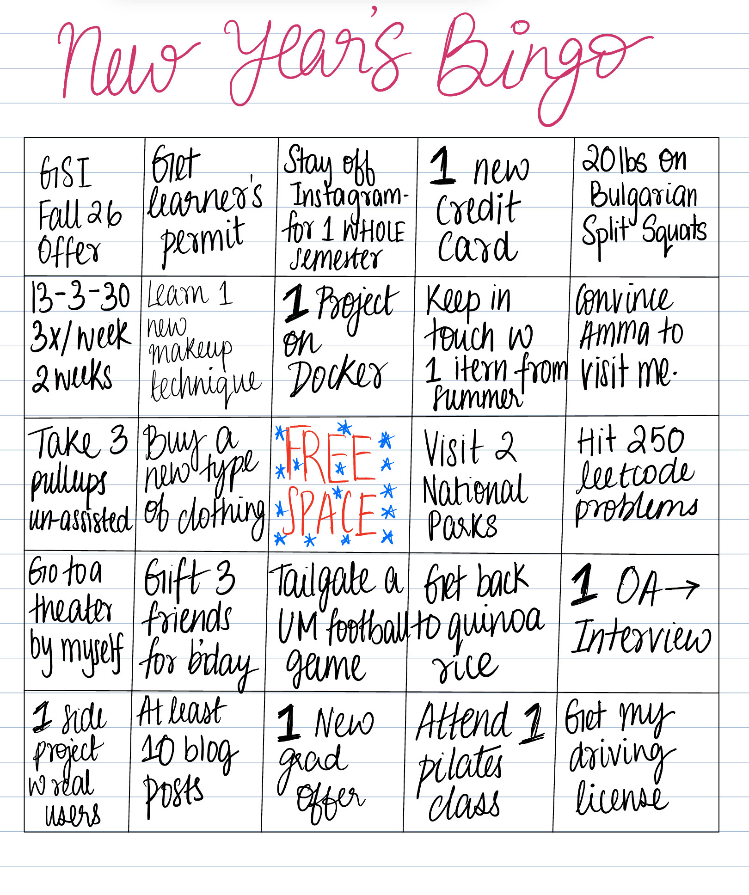

I’m trying to just write more because i want to. I feel like everything i write needs to actually help someone but honestly there’s so much slop out there at this point, I shouldn’t care too much if my work doesn’t actually help you. So here’s to 2026 - to write because i want to :)

I stopped making resolutions last year because i was having a hard time following through and this is almost everyone now. Instead I saw somewhere how you can make a new year bingo card of smaller, more realistic little goals and try to get a bingo by the end of the year! I made one last year and I was actually really close to a bingo so I have decided to do it again this year. If you’re reading this, maybe give it a try to make your own new year bingo and you might be pleasantly surprised. 

Also just word of advice make sure you have this somewhere - at one point i forgot about my bingo card so make sure you have it somewhere to look at ! 

For accountability here is my bingo card :

