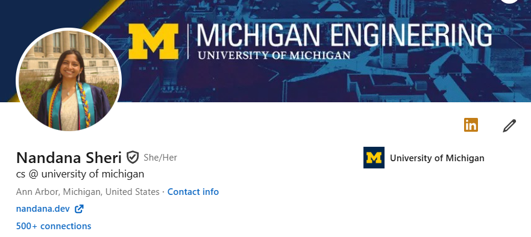
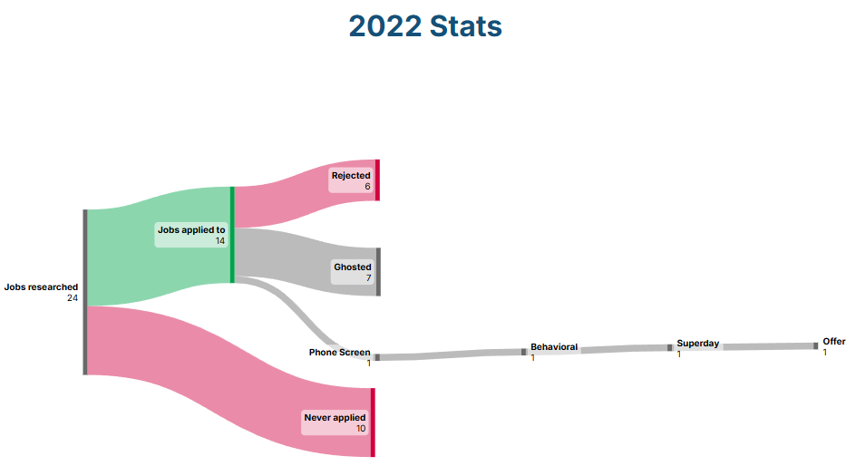
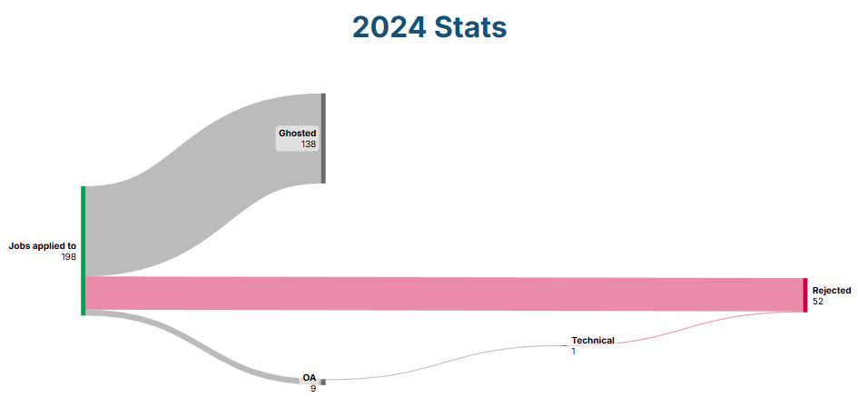
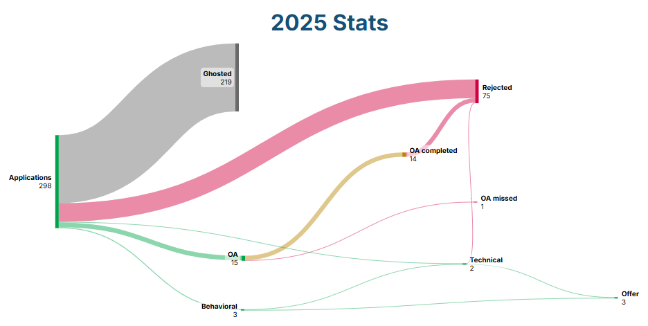
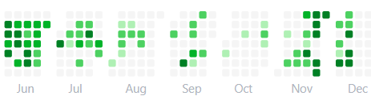
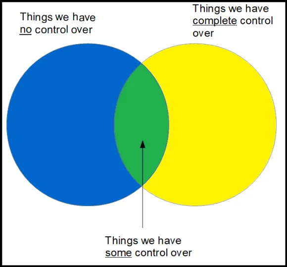

Fair warning: this is long and exhaustive. It's long and exhaustive for a reason. Recruiting in 2023 wasn't easy. Recruiting in 2024 wasn't easy. Recruiting in 2025 wasn't easy. Recruiting in 2026 is probably not going to be easy. 

## Background
I started my BS at the University of Illinois, Chicago in 2021. I've recruited for an internship in 2022, 2023, 2024 and 2025. So that's four seasons. In 2022, as a sophomore I got an internship at an insurance company in Chicago through a referral and 3 rounds of interviews. And then layoffs hit - most companies that used to traditionally hire from UIC *stopped hiring internationals* and I never got a return offer as a consequence. From there I failed to secure an internship for the next summer and focused on grad school applications my senior year. 

Fast forward to 2026, I have two SWE internship offers and I'll be starting this May at DoorDash in San Francisco. So here is every failure I hit and everything I learnt from them. This will be SWE focused because it's the only role I have recruited for. Again, these are my failures and my experiences - **not a recipe on how to land a job**. I've been doing this for long enough to have opinions and regrets that I'd like to share in the hopes that it helps you. 

## Resume
I have quantity in my resume but not a lot of quality. I've done a lot of things but I don't think I've done many mind blowing things. When I look at a resume I prioritize **Experiences > Projects > GPA > Leadership**. Experiences can be that TA position in school, research you do with a professor, tutoring, mentoring, lab assistant, a fellowship anything that you think is the most relevant to your skills. 

Anyone who tells you School Name doesn't matter on Resume probably goes to a good school. Moving from UIC -> UMich, I've felt more valued because I have Michigan on my Resume (though most of the opportunities I have on my Resume came from UIC). GPA doesn't matter - I had a 4.0 and nobody really cared though sometimes hiring managers would be mildly impressed. You're not really getting hired to take exams so don't lose sleep over your GPA. You need experience to get experience (it's a vicious cycle I know) but I'll write about things I did to build up experience even when I didn't have an industry internship probably in another blog post.

Projects matter. As an underclassman, your class projects are probably what you put on there and that's understandable. Though when companies recruit from schools I have heard them get tired of seeing the exact same project. If all 300 of you took CS-1 together and have the same OpenStreetMaps or Euchre Project on there, how can they differentiate your skills? This is where I pitch hackathons : it's accountability to build something unique (to some extent). **[Go to Hackathons !!!](https://www.mlh.com/seasons/2026/events)**

Also build a portfolio! - almost every application has a link where you can provide one. I think it's a fairly easy side project too and you can add whatever the heck you want on there! Like a blog about recruiting or your lovely spring break trip. **Live links for projects** is also something engineering managers like to see. As you get older and if you are interested in the startup space, projects matter a LOT. Having real users also matters. But that's an advanced goal to aim for. But do GTFOL and **deploy your projects** - no one is going to clone your repo to see your React frontend.

Finally, ask people to review your Resume. When I go to Career Fairs, I'll usually ask recruiters for advice on things I should change. I sent mine over to upperclassmen, mentors and new grads - ideally people who have recruited for the role you are aiming for. Engineering Managers and New Grads give great advice. *I don't ask advice to anyone who got a job before 2022* - they just don't know how to play the game anymore, the market post 2023 is not the same (no offense COVID grads you had your own battles (maybe)). My Resume is a Google Doc with commenter access to anyone. Critically think of the advice you get - some things might not apply to you. 

Also for international students, make sure to Resume has been rewritten in the US format. 

I also do think having a flushed out LinkedIn helps. I have had several recruiters send me messages because of having a fairly visible LinkedIn. I even got an invite to a Snap Recruiting event in Chicago that guaranteed a first round interview. Don't ponder too much over the details though.

Link your personal website to LinkedIn - I'd much rather look at someone's website and this is a nice way to have visibility.

To summarize this section :
- Quality > Quantity
- Experience > Projects > GPA > Leadership
- School Name does give some folks an upper hand but nothing that your Experience cannot make up for!
- Hackathons are a great way to get unique projects (outside of class projects)
- Portfolios are a good starter side project + deploy your side projects and add live links
- [Jake's Resume Template](https://www.overleaf.com/latex/templates/jakes-resume/syzfjbzwjncs) is industry standard for CS students. [I like this guide as well](https://www.techinterviewhandbook.org/resume/). 

## Applications
When I recruited in 2022, I got an offer within 24 applications. I regret this because I didn't realize the volume I would have to be sending out to have something stick in the future. 

Do referrals matter? I think it depends and have probably gotten less important over the years because of how easy it has become to get a referral. I think smaller/mid sized companies, they do matter more than bigger companies where they might be getting a lot of employees ready to refer people. Note to International Students : a referral means nothing if the company doesn't sponsor. I've had 3 different referrals that all fell through, even a scheduled interview canceled once they realized I need sponsorship.

2022 stats: I was a sophomore, mainly only applied to things like Google STEP and Uber STAR. I didn't apply to a lot of places because I self rejected. As you can see my referral was the way I got my foot through the door.

2023 Stats: can't find it because I was moving out of Notion into Google Workspace. I will say this was the year I got fairly a good amount of movement. I was a junior (ideal grad date) with an internship! However I fumbled (which I will talk about later.)

2024 Stats : I started applying in July for new grad jobs because I was set to graduate in December. It was too early because I got almost no movement except a failed technical. So I decided to push back my graduation date and pivot to pursuing my Masters so that I'm not panicking. I didn't try to find an internship and solely focused on my grad school apps and ZERO regrets because that was the summer I set myself up for the recruiting season. **To international students:** graduating in December if you don't have an offer lined up, gives you 4 months to find a job. It's a tricky situation to put yourself through, especially since most companies start recruiting for new grads later than interns. Do it being fully aware of the risk.

2025 Stats : 3 years of mistakes to learn from! Here is what I did.

- I don't think you can be *extremely* targeted with applications where you pick and choose and apply to a handful of your finest in this market. I applied to about 400 places (cold, but stopped tracking after 300) *where I met more than 50% of the Job Requirements* and heard back from a lot of places. I was pretty desperate for experience and so if I matched the JD, I applied.
- Networked with alumni on LinkedIn, set up coffee chats throughout the entire summer for referrals and received a few. I had diminishing returns talking to new grads because as I said, the advice was nothing I had not heard.
- I used Simplify to autofill, [JobrightAI](https://jobright.ai/jobs/recommend) to find apps, and SWE GitHub Repo. JobRight was the fastest to get apps.
- I applied within 24-48 hours for bigger companies. Also followed zero2sudo on Instagram for internship drops (like it's merch lmao). I don't believe in waiting for your resume to get better before you apply - that should have been done in the summer not a week after Google releases internships.
- **I did not bother with any company that doesn't hire internationals** - I know enough people who had their offers rescinded because they didn't reveal immigration status. Don't waste your time. 
- Did I tailor every Resume I sent out? God no. But I did to the companies that mattered the most to me. Spent half a day on Gusto's application to get rejected pretty quickly! I know Duolingo also *cares heavily* about your free responses.
- Don't just aim for big companies at your school's career fair. One of my offers was from a mid sized healthcare company that had no line at the Career Fair.
- Recruiting Events helped. I got Stripe's OA just because I spoke to a Recruiter when they came to campus. 
- I did cold message recruiters on LinkedIn but never led to anything. 
- Applying is soulless - I was doing it whenever I had off time. 

Stats are still not impressive. I'm glad I got 15 OAs and I failed yet again because not a single one converted into next round.

## Online Assessments
This is my Everest. I have notoriously failed OAs and frankly I struggle with seeing progress too. I've looked up 'how to get better at OAs reddit' far too many times than I admit. I think OAs are a matter of luck, some are doable, some are bitwise greedy problems that Uber throws at you... I am still doing Leetcode in the hopes of getting better at OAs. 

CodeSignals are not easy. [Here's a document that goes over the Framework](https://discover.codesignal.com/rs/659-AFH-023/images/General-Coding-Skills-Evaluation-Framework-CodeSignal-Skills-Evaluation-Lab-Short.pdf) that might help you understand its structure better. I have never done more than 1 GCA so I can't comment much. Though in our era, there are ways for you to get practise in for GCA as well. 
One of my big goals is to convert an OA to an offer so maybe I'll come back with an update next year. 

## Behavioral Interviews
I will say I am quite educated in this topic because I have never failed a behavioral. The ONLY thing you need to know here is **do your research**. Here is my format:
- When a company reaches out, I essentially create a document about *the company, me and how I connect myself to the company*. The power of story telling is showing the recruiter that there is no better fit than you. 
- Follow [STAR](https://capd.mit.edu/resources/the-star-method-for-behavioral-interviews/) because structure makes conversation easier to keep up with. Do not ramble. 
- Have 4-5 stories that can be wrapped around any possible question. Accomplishment, Failure, Conflict, Disagreement with a teammate, Goals, Technical/ Non Technical Challenge. 
- Have a rock solid answer for 'Why this company?' - every single answer of mine was a personal anecdote. When interviewing for healthcare I talked about the time I had to stay home with a skin infection because I couldn't get an appointment for 3 weeks and how everyone deserves timely care. Connect your story to the company's mission. 
- Drive your stories with company core values. 
- Practise in front of a mirror and practise with friends.
- Curate interesting questions! People love talking about themselves. Look up your interviewer on LinkedIn and show them you have done your research by asking questions that tie to their experiences and their years of expertise. Don't ask questions for answers that can be found on the Careers Page of the company (anywhere). Interesting questions lead to interesting answers!

Surprisingly I've had to help peers with behaviorals. People want to see passion and the fact that you are in fact not a bad person to work with. Be cordial and relax!

## Technical Interviews
I've spiraled after too many technicals to count. To me personally, technical interviewing and solving convoluted puzzle like coding problems under a time crunch was like Math. How did I get better at Math? [Solved RD Sharma twice in 2018.](https://archive.org/details/isbn_9789383182008/page/n9/mode/2up) So I decided to apply a similar approach here. 

I did a lot of leetcode. [Neetcode 150 was a really good list](https://neetcode.io/roadmap). Go topic by topic, document problems solved and whether you were able to. I spent 10 minutes trying to solve it, if I reach nowhere I look at Neetcode's solution. I go over the algorithmic approach in the video, then I try to code it by myself. Usually I can get things working by then. If not, I'll look through the coded solution. Neetcode is the single best thing that helped me get better at solving these problems. I did around 2-3 problems a day in the summer, closer to my interview I was solving 6-7. **Consistency was the most important thing for me**. Cramming before an interview hasn't historically worked so I was doing problems for a couple of months and revisiting them after a couple of weeks (spaced repetition).

[Here is my Leetcode Tracker](https://docs.google.com/spreadsheets/d/12HTn7J20fcf9rRZSqBZEAsUUteruPn25UpufvegiZpo/edit?usp=sharing). It's messy because it's borrowed from a lot of places. I also highly recommend Shreya Ramakrishnan's Blog Post : [Notes from the Interview Trenches](https://medium.com/@shreyaraja02/notes-from-the-interview-trenches-8dfc7a55f1ca). She has a nice list of questions to grind (from which I took a lot) with a lot of great advice.

As you keep practising, you'll realize the algorithms are straight forward. There is a set of rules on how to code a Binary Search, a Sliding Window, a 1D DP, Dijktra, BFS, DFS - there is a consistent structure you will see come up. This should take up as little cognitive load as possible. If you know the basics of these algorithms because you have coded them enough, now it's a matter of application. How can I modify this Binary Search to fit this problem? How can I dynamically change window size as I slide through? The way I think about Leetcode now is puzzles that have a straight forward algorithm along with a 'gotcha' that trips me up. All my cognitive load goes into *figuring out the gotcha* and of course debugging. 

Also these weren't solely my observations : [Neetcode's founder talks about how he would learn if he had to start over here](https://www.youtube.com/watch?v=aHZW7TuY_yo). Definitely worth a watch!

Finally, what changed the most for me was mock interviewing. I was constantly doing mocks; in the beginning once a week but honestly as I got closer to interviews, they were 3-4 times a week. Mocks helps you understand the time crunch, it makes you realize your mistakes and you also learn about others mistakes. You can do mock interviews with strangers on [Exponent](https://www.tryexponent.com/home). Honestly though? find a friend - someone who is recruiting with you and keep each other accountable. Curating a qeustion for my partner made me have to solve the question beforehand to ensure it's doable. I was able to identify my own flaws and get much better at communicating through code solely because of mocks. Huge shoutout to Yashi - I know I would not be here without her. I also watched [other people take technical interviews](https://www.youtube.com/watch?v=V8DGdPkBBxg) to understand flow and structure. 

## Regrets
This might be long - I apologize.
- Start Early. I didn't know how early in the beginning. If you are looking for a Summer internship, SWE recruiting begins in Fall (August). I solved 150 problems, set up my Resume, redid my website, worked on a side projects and deployed them through the summer (this was easy to do because all I did was part time research). Set yourself up in the summer, **start applying Early**. Internship recruiting does slow down by November and there are never as many open positions in the Spring BUT it's never too late to land an offer. One of my closest friends got an offer in April and started her internship in May. 
- Nothing is guaranteed to you. An OA does not mean an offer. A phone screen does not mean an offer. A technical interview does not mean an offer. An internship does not mean a return offer. Don't stop applying because you got an OA. Don't stop applying because you got a first round. Don't stop applying because you made it to the last round. I did and I spent 4 weeks in the loop of interviews just to get rejected and realize a lot of companies had closed internships by then. Do not let a failed interview loop decrease any more of your chances. You just have to keep going. 
- Have a strategy! Track numbers, analyze what companies are interested - focus on that. If you don't get any OA's/phone screens, your Resume needs to be better. If you don't ever move past the OA, you need to do more Leetcode. If you never move past a technical, you need to do more leetcode and mock interviews. Every recruiting cycle I tried to reflect on my failures, draw from those mistakes and make sure I don't repeat them.
- You're not incompetent. I have had too many of my failures make me feel like I can't code. Funny because I had good grades. No one makes aerospace engineers build or test rockets during a live interview under 45 minutes that then need to undergo a bunch of validation tests for a job. Our degree can be easily simulated through these coding environments which makes us need to jump loops and solve puzzles for the sake of an income. It's a pity but the good part is, it's standardized. You can study for it. 
- I think about this figure a lot. Focus on what you can control or else you're going to lose your sanity over the things you cannot control.

    - A recruiter calling me up after a phone screen to tell me they don't hire internationals anymore? I can't control.
    - Not getting a phone screen after submitting an application I spent a day on? I can't control.
    - No will to apply to jobs after courses? I have some control.
    - Getting better at Dynamic Programming? I can control.
- A *lot of this is luck*. Maybe you got lucky getting picked out of swarm of Resumes. I know I got lucky getting interview questions that were similar to problems that I had solved. I know I got lucky getting an interviewer who was attentive and willing to steer me in the right direction. I don't mean to disregard anyone's hardwork but luck is a factor you just cannot ignore. 

## Summing up
You got to keep going. I remember the sleep I got the day I got my internship offer. It's something that has bothered me since October 2023 from the day I failed to secure my return offer. Frankly, sometimes I feel a void because for so long this has been on my mind. But well, this summer will be my short break in San Francisco before I get back on the hunt; this time for something a little bit more permanent :)

Until then, good luck to you stranger, you got this!

