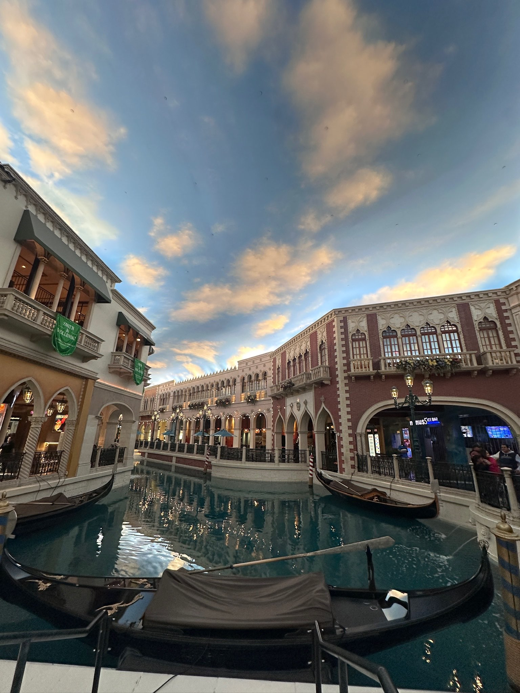
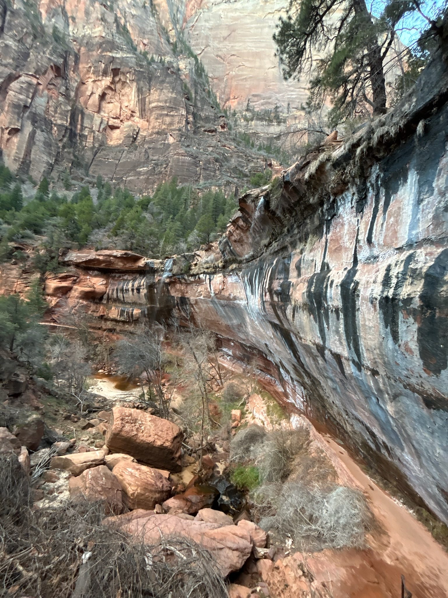
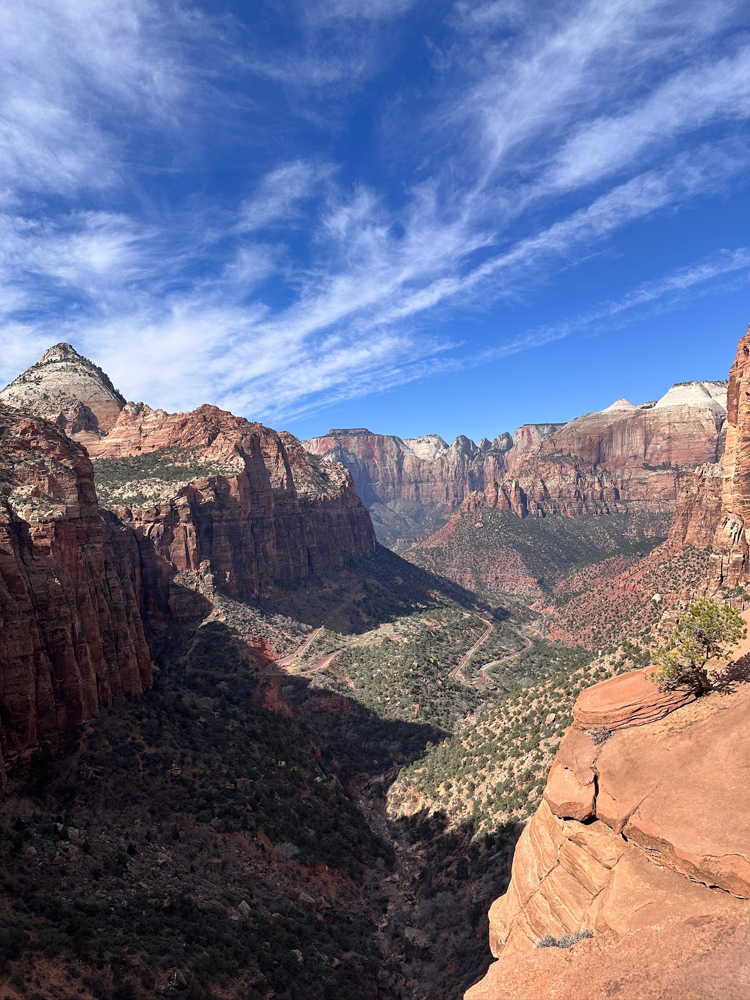
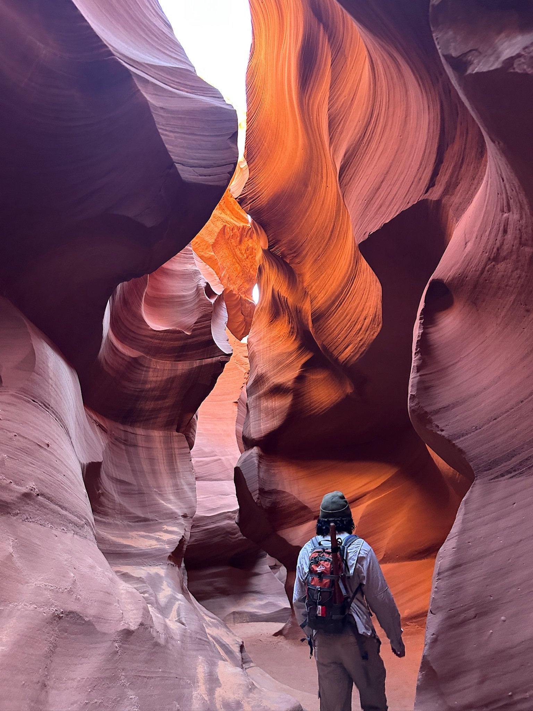
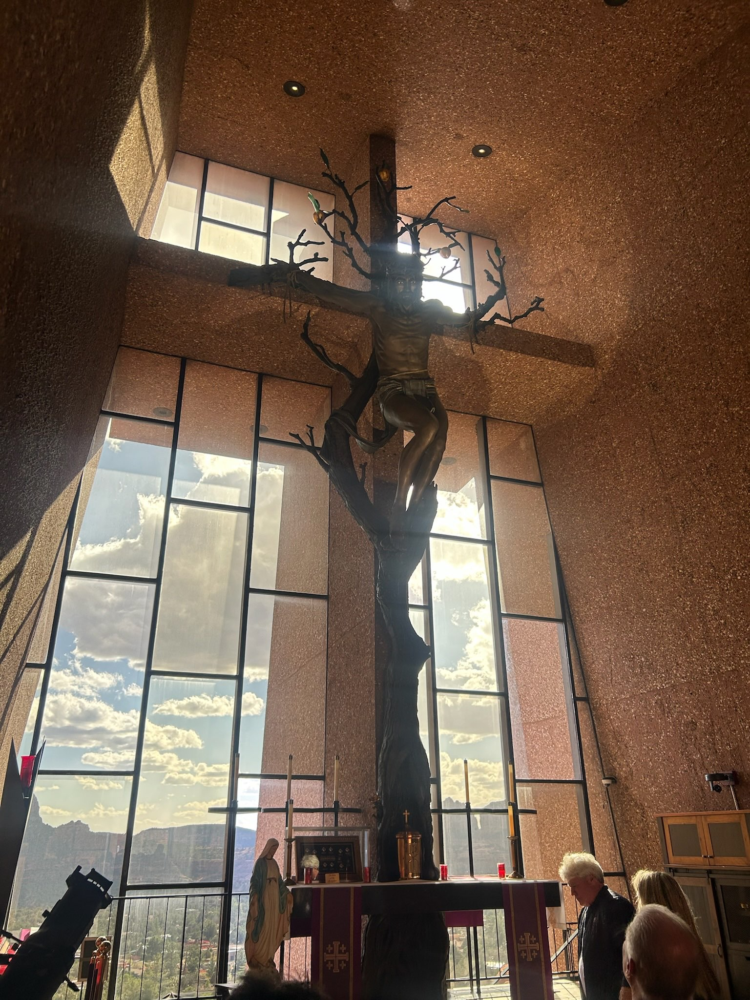
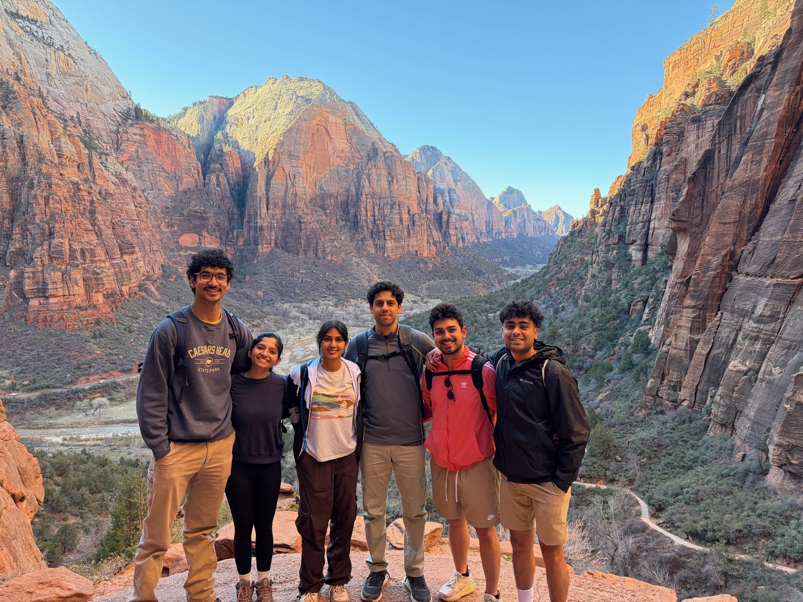

Usually Spring Break is nothing crazy. We went to Milwaukee one year because it was close enough from Chicago. But this year, I finally had some earnings to justify a larger trip so my 5 friends and I decided to plan a trip to the Southwest of US starting at Nevada to Utah and finally Arizona mainly aiming to see canyons, mountains and national parks. It was an unforgettable trip and so if anyone is planning on visiting that part, here is the breakdown of everything!

## Flying into Vegas
We flew into Vegas because our first destination was Zion National Park in Utah and Vegas was the closest airport. I have actually never been so we spent the night there, walking through the Las Vegas Strip! In and out of gigantic hotels and resorts, the craziest part was the first thing we saw as I exited the airplane was a casino with slot machines at the gate! We didn't plan for Vegas so it was a lot of sightseeing and an overpriced restaurant. Might go back for the casinos because I recently learnt poker :)

## Drive to Zion
The next morning, we picked up our wonderful mini van (an amazing Chrysler) and hit the road. The drive from Vegas to Zion is beautiful because you can see the scenery change from desert to mountains. One of the best parts about the trip was that we were never on the road for more than 3 hours. I remember being in awe with just how much I missed mountains (we have no mountains in the Midwest, but Oman is filled with them). I had a notes app worth of random questions (which I *think* my friends appreciated) to make conversations interesting as we were in the car!

## Day 1 : in Zion
We got to Zion in the afternoon so we decided to do a couple of light trails just to catch a few views. We started with the Riverside Walk which was more of a leisurely stroll, less of a hike where you can see people hiking through the water to the Narrows! We then went to the Upper Emerald Pools trail - this one tested me a bit because of elevation and we were going into the canyon. But the views were immaculate and I was feeling a great tired. We finally drove to Hurricane, Utah to our airbnb which was honestly a sight to behold but I'll talk accomodation logistics later. Did a little bit of stargazing in the jacuzzi because Utah has some of the darkest skies in the country. 

## Day 2 : still in Zion
We aimed to head out early but with 6 people all taking their own sweet time, didn't really work out in our favor. Day 2 was packed with a lot of hikes starting with the Canyon Overlook Trail which was one of my favorite trails! It was pretty light but the views at the end were so rewarding. We also went through the tunnel which was fun. From there we headed to our BIG GOAL : Angel's Landing. Unfortunately, that side of the park that opened to Angel's and a couple of harder hikes was closed off by afternoon because of capacity :( so fair warning **If you plan to hike Angel's, start earlier in the morning for lesser crowds!** - this was a Monday during off season (early March), so I can't imagine what crowds would be like in the summer. We pivoted to shorter hikes like Pa'arus Trail, watched a Ranger give a talk about the geology of Zion mountains (made up of Navajo Sandstone) and ended at the Lower Emerald Pools Trail at sunset. You get to actually go behind a waterfall which I loved!

## Day 3 : Angel's Landing!
We weren't planning to come back to Zion on Day 3 but we just HAD to try Angel's so I set up a 6am alarm, woke the whole household up and we were out by 7.30am. It was 30 degrees when we started at the West Rim Trail but we packed lots of water and snacks, and with adrenaline pumped up it was a fun beginning.

This was a hike that truly tested me. I was out of breath a couple of times, the elevations were steep, you're climbing before you realize it and there are a lot of [switchbacks](https://myoutdoorbasecamp.com/what-is-a-switchback/). However, these were the most rewarding views. Seeing the sun slowly light up the mountains, working it's way down, it was gorgeous. One thing I will say **stop every now and then and take in the view** - we get so winded up in hiking that we forget that it's a marathon not a race. Take your time, take in the view, take pictures, stop to breathe, stop for snacks, stop to ask random questions!

I'd like to say that we actually didn't have a permit for Angel's, we just assumed that the Ranger might not be checking. However, they were checking so we got to Scout's Lookout but couldn't summit Angel's Landing. Hey - all the more reason to come back :3. It was nice and warm by the time we got to the top. We sat there and took it all in. One of my favorite things would be when my friend would say 'everyone! 3 minutes of silence!' - I'm a relatively talkative person even when I'm a little out of breath but just sitting on a cliff, observing the views was true peace. I had no thoughts in my head and that is a rare scenario. I'm also not including pictures of these hikes because they're all over the internet + you should probably go in bling if you're planning to do this.

## Heading over to Antelope Canyon
We left Zion in the afternoon to drive to Page, Arizona to our next stop : Antelope Canyon! This is in Navajo Reservation so if you do want to see the canyons, you'll need to book a [Navajo Guided Tour](https://www.antelopelowercanyon.com/) - we booked Dixie's and I cannot recommend Isaiah as a tour guide enough. 

This was the most stunning canyon I have ever seen. We did do the Lower Antelope Canyon Tour over Upper because the views are *much better*. You walk downstairs through ladders into the canyon and then just watch as you are blown away by its beauty. It feels like you are in a wallpaper - literally, because you are! ([Both Apple and Windows has wallpapers from there](https://www.socwall.com/desktop-wallpaper/46823/antelope-canyon-by-apple/)) This isn't really a hike - moreso a very instragram-able photo background but it's truly worth the views at least once!

We also made a pit stop at the Horseshoe Bend also in Page for both sunrise and sunset. Lesser crowds, an enjoyable sunrise. 

## Day 4 : Grand Canyon
Grand Canyon was a day trip for us. We drove from Page directly this was pretty leisurely. Grand Canyon doesn't have the same stunning views as Zion does as you drive in - it's really all about the Canyon itself. We also went to the South Rim because North Rim doesn't open until mid May. Our first stop was a view point at the Dessert Watchtower. It was a very nice lookout, you got to see the canyon in all its glory, see the colors of the canyon - it was very 'grand'!

There are a lot of trails at Grand Canyon but a large majority are around the Rim (the edge of the Canyon). However, there is the iconic Rim to River hike that basically takes you from the edge all the way into the canyon to the Colorado River flowing. This is a very dangerous hike and we hadn't properly trained for it of course so we decided to hike into the Canyon until the first check point called the Ooo Aah Point! 

Hiking into the Grand Canyon is very different because the first leg of the hike is the easy part since you're going downhill. This is what makes it so hard to gauge how much further down you SHOULD go because the further down you go, the further you need to walk back up. This is not easy to estimate so I can see why people have to be airlifted out of the canyon ([see NPS official guidelines](https://www.nps.gov/grca/planyourvisit/day-hiking.htm#CP_JUMP_1910241)). Going downhill you just feel it in your knees but climbing uphill you feel it everywhere. If you are ready for a mild challenge and not a trained hiker - the Ooh Aah Point is totally doable and the views of the canyon are much more magnificent as you are in the Canyon than on the Rim. 

We also caught a beautiful sunset and my only regret is that I wasn't closer to the Canyon during sunset.

## Stargazing in Flagstaff
We drove that night to Flagstaff where we stayed for a night. Once again, some of the darkest skies so we drove up to a park to catch some stars and look at constellations and that was a lot of fun. It was really cold though which was a shame because you could see so many different constellations and it's something you can never see in Ann Arbor or Chicago the same way. I was also shamed into watching Cars since I had never and that was a lot of fun and very fitting after our Zion trip.

## Day 5 : Sedona
Packed our bags yet again to drive to Sedona, Arizona for their iconic red rocks. We first stopped at a quaint little village called Tlaquepaque (my friend who is an AZ local kept saying *Locky Pocky* and we genuinely thought that was how it was pronounced but it is not....) This was what I would think European towns would resemble! We were in and out of small stores admiring wine, oil, watches, books, coffee everything. Also went to a restaurant called Hideaway House which has a beautiful view of Sedona's Red Rocks and ordered this *peach and pancetta pizza* - some of the best pizza I've had WITH peach cobbler.

We then headed to this beautiful chapel on top of a hill called Chapel of the Holy Cross. Quite possibly one of the most beautiful chapels I've been to (definitely after Washington National Cathedral). We also went to Bell Rock but didn't hike because we had left our hiking mentalities in Zion and Grand Canyon. 

And finally, we drove to Phoenix, Arizona

## Day 6 7 : Phoenix
To be honest, we slept and ate. My friend is from Phoenix and her mother is a gem of a woman who stuffed us with so much food. She has a lemon tree in her backyard! The suburbs of Phoenix are surprisingly different from what I had seen in all of the US I have visited. All of the Midwestern suburbs looked the same to me so this was a welcoming change. They also have tall cacti! (Fun fact we don't have cacti in Oman so I was as excited as everyone else). 

We did go to Topgolf and I DID make podium (don't ask me how my swing is pathetic but clearly there were more pathetic people - my dear dear friends). And with a heavy but a very full heart, we flew back to Detroit.

## Logistics
For a group of 6:

- We lived in a combination of hotels and Airbnbs. Airbnbs in the middle of nowhere are very affordable ([this one that was one of the fanciest places I have lived in](https://www.airbnb.com/rooms/1376097936565649476?location=Hurricane%2C%20UT&search_mode=regular_search&adults=1&check_in=2026-04-25&check_out=2026-04-30&children=0&infants=0&pets=0&source_impression_id=p3_1773344422_P325kOY1HOs6mQoM&previous_page_section_name=1001&federated_search_id=5974ce6e-4190-4758-8329-0bc430159abd))! We paid a total of 181$ each for 4 different places
- Flights came to $330 per person. Detroit to Vegas is 4 hours so this was one of our biggest expense. Even with the fact that the driver was under 25, our mini van came up to $105 per person with a AAA membership. 
- Food was pricey $200 for my share. Had to eat a lot to ensure I have energy for these hikes. 
- Snacks from Walmart for the hikes $20!
- Experiences like the Antelope Canyon Tour came up to $100.
- Approx $1000 spent in total. 

## Tips
- Get a permit for Angel's Landing - don't risk the Ranger check and get there early. 
- Personally and most of my friends agreed that Zion > Grand Canyon. I'm glad we spent 2.5 days in Zion and 1 in Grand Canyon. 
- [America the Beautiful Pass](https://www.recreation.gov/pass/) is worth it since it lets you enter multiple parks for a whole year.
- If you can early March was an amazing time to visit. Much lesser crowds everywhere we went. Our Antelope Canyon tour guide was talking about how insanely packed it gets during the summer. Also early March weather is very pleasant - I would not want to be hiking in AZ summer. 
- Walking sticks are worth it for hard hikes.
- Wear shoes/boots with **good grip please**. I'd also recommend shoes that are taller and offer ankle protection, which saved me countless times. Good grip and waterpoof were also so helpful and frankly it's an investment. 
- You will lose signal everywhere! Make sure to have a Map through the parks, maybe download music, have things to entertain you beyond the internet.

## Regrets?
- I wished I had caught more sunrises but it's hard to get everyone up and out on time.
- We could have bought more groceries and cooked at home which would have saved us money. The trip was never about good restaurants.
- Nothing else - it was one for the books.

Also I had a document of everything with links, guidelines, prices to give everyone an estimate. Having logistics flushed out and thorough helps everyone on the trip!

Thank you for reading and I hope to God that you find yourself in Utah one day. 

