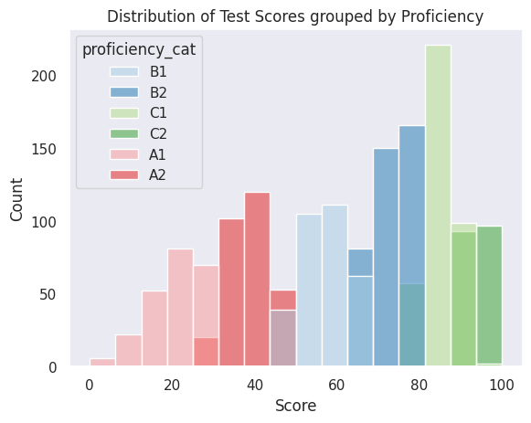

## 1. Teaching Assistant
My first job at UIC. I sat in the front row of Prof Bello's CS151, I enjoyed the class, I got a decent grade and I applied. This was back in Fall 2021 but getting a TAship isn't as easy now. If you want one, go talk to the professor - actually show up to class, be a good student. Show up in week 11 when no one else is showing up to class. From my personal experience, cold emails doesn't work because a lot of professors have too many of them. Show up to office hours, introduce yourselves, and be authentic of why you want to TA. Sending out an application just doesn't cut it anymore. 

In all honesty, it's one of the best jobs I've held. I learnt more through teaching data structures for 3 semesters than I did taking it one time. You learn to break down concepts, explain code, what good code is and you build wonderful connections with professors who will vouch for you. It's also a great job on your resume and very comfortable to balance with your courses. 

**Wage : Started at $14.2/hr in 2022. Moved to 16.2/hr in 2025.**

## 2. GPIP Intern
The official title was Distributed Data Management Intern. Frankly I wish I had enjoyed it more but I worked on something purely theoretical and it wasn't even in my area. It was heavy math but it was something to put on my resume. It's great for a freshman year summer experience but your placement makes or breaks your experience. Make sure you satisfy all requirements for GPIP but it seems like most freshmen these days are hustling for an internship. Regardless - good backup!

**Wage : $14/hr in 2022**

## 3. Engineering Success Program Mentor
My roomate applied so I applied. It was fun - I made slides, I taught a couple of sections of incoming students and I also tried to change up the resources for the CS Students to be things that were beneficial. We talked about resumes and internships. I realized I couldn't change much in terms of course structure and left. It also got draining with some of my fellow mentors. But leading a class of 20 students as a sophomore was new and exciting at least in the beginning. 

**Wage : $15/hr in 2022**

## 4. Head Teaching Assistant
Was Head TA for CS111 - Breakthrough Tech during the summer. Got this position because I reached out to Professor Reckinger and we knew each other through WiCS (student org involvement goes a long way). Made me love teaching again - I really enjoyed the smaller cohort and designing Project Jumpstarts. One of my favorite courses I was a TA for.

We always found slides themes that matched the project aesthetic - I hope it meant something to the students.

**Wage : $17/hr? in 2024 (tbh i never asked i thought it was rude)**

## 5. CS111 Recruitment Lead
This role didn't really have a name. I got this job solely because of my network. Professor reached out - I said yes. I designed and built the [CS111 Course Website](https://111-summer.cs.uic.edu/). I did marketing, wrote a lot of emails and worked via the Emma platform. It was mostly marketing with a lot of creative independence on the website (though customizing the accent color on the website was Professor's idea).

I don't like this color but Professor loved it.

**Wage : same as Head TA**

## 6. Curriculum Design Assistant
This role also didn't really have a name. I took a Linguistics class with Professor Carrie Pichan and loved it. She was auditing CS111 the previous summer I TAed and that's how we met! She was interested in incorporating a more technical approach for a lab for LING220 where we work with Phonetics data for CS+LING students and I was down. Instead of doing data analysis and visualization via Excel, I created a Jupyter Notebook template to work with Phonetics Data via Pandas and Matplotlib. We designed scope as we worked through the problem. Not challenging technically but open ended and fun!

**Wage : one time sum of $400**

## 7. LLM Researcher
This is a research assistant role but this sounds so much... *nicer*. Ironic how the last position I hold at UIC is unpaid. I'm working with Dr. Shweta Yadav on Radiology Report Generation with Vision LLMs. I work on multimodal input on models run on Ollama and establishing a workflow with LangChain. It's ongoing and I'm learning a lot about different inference techniques. Also reaching a wonderful realization that LLM work is so limited by hardware :( If you have the privilege to pick up unpaid work - research projects will teach you a lot (and patience). 

**Wage : paid in technical experience :)**

Every position I have held has taught me something valuable and so I highly encourage you to look into these. Frankly I was completely unaware that internships during your semester is even a possibility but I was able to balance these positions with school quite okay. Grateful for every job and reach out if you have questions!

