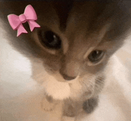

I built the first iteration of my personal website last summer. A [friend](https://olympicene.dev/) and I worked on our websites at the same time and though he added a blog, I *conveniently* left it out. 

A lot changed that summer. I started coding more for myself. I tried to make things - *very finnicky* things but still things I was pretty proud of! (back then at least). When senior year came along, I had very few classes left so I shifted my focus to WiCS - Women in Computer Science, a student org at UIC I was proud to call mine for a year as Co-President. 

Being a Teaching Assistant and being heavily involved with student organizations through WiCS and SparkHacks, it always gave me a chance to talk to my underclassmen and pass along pearls of wisdom founded in a lot of my own mistakes and regret. Everytime we hosted an event, some sophomore would come to me after, introduce themselves and ask a really open ended question and I'd spend the next 20 minutes explaining recruiting in 2025 to a 19 year old. **And I really enjoyed it.** During my last weeks before graduation, I found myself helping out my younger officers on board because I wasn't going to be around anymore. 

### It wasn't like I was dying, I was just graduating!

But I did realize that documenting little things along the way for mostly my sake but also for any stranger on the internet could be my way to cope with the fact that I won't really have underclassmen to bother. I also love reading new grad software blogs and hearing others students' journeys through tech. So when I decided to redesign and rewrite my personal website from React to Astro, I decided to add a blog! If you're curious about my previous iteration of my personal website it's on [v1.nandana.dev](https://v1.nandana.dev/) - one of the *abovementioned* finnicky things from last summer! (that I am still proud of.)

### So.. what is this about?
I hope to write about random life lessons, figuring out university, graduate school, computer science and hopefully some things about technology. Experience is the greatest teacher and I would like to curate those here to look back on :)

Thank you for reading!

