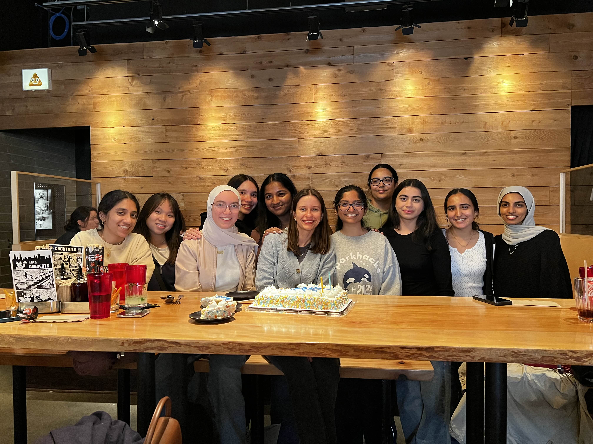

If you have known me for the past four years, you've probably heard me talk about WiCS. WiCS is a student organization I found strolling through the UIC involvement fair back in my freshman year in August 2021. This was back when everyone was still masking, most events were still online and yet WiCS was doing tons of events. 

I'd be lying to you if I said I was an active member that year but I showed up to their Scavenger Hunt and found myself running around campus with one of my professors and calling my mom at 4am her time to solve an SQL Natural Join question for me. 

For me WiCS was a beautiful third space and frankly the biggest reason I made my friends at university. The WiCS lounge was empty, adopted by people I took classes with. And for students who were just starting out their undergrad, we had *a lot* of free time to talk about everything under the sun. Those conversations were the foundation of some friendships that exist years after we've been in the lounge together. 

My senior year resume was what it was because of opportunities that I was able to find through WiCS. I met a lot of upperclassmen who were my TAs but also WiCS executive officers very eager to help with resources and openly advicing me to get involved. I think I internally adopted them to be my mentors/older siblings and I remember talking their ear off and asking them questions about what I should be doing as a freshman. They never once looked annoyed and it was that welcoming feeling that I loved about WiCS. 

When I joined the board my sophomore year, I mostly joined to get closer to these women I admired so much. And I had a lot of fun at the events. But as I kept going I found a very huge responsibility, as I rose up the ranks to maintain what my alumni left me but also keep doing more for the benefit of the incoming students at UIC. By junior year, along with directing SparkHacks, the hackathon that WiCS began - that weight was heavy to carry but the power to change the culture at UIC was consuming me.

Especially with the onset of SparkHacks, I truly believed that I could bring about real change. It was the first time that people were coming up to me and telling me that something I started helped them. That feeling of **being respected and thanked** was a high that I chased by constantly diversifying the kinds of events and resources we were putting together. 

As the market got competitive, students started realizing that the bare minimum wasn't getting them a job anymore. And there were many students who started joining student organizations, hackathon boards for that exact reason - *a line on their resume*. 

### Frankly, there's nothing wrong with putting yourself first - I wish I did more often.

However, when your reasoning to be a part of a community is *solely* because you want to gain something from it, you're not prioritizing what the organization needs, you're only prioritizing yourself. One of the hardest things I have had to do is try to understand what students' true intentions are when getting involved. 

So, giving back to students can come from a place of wanting to help: it's a very simple idea of paying it forward. If you believe that the reason where you are right now, is because of someone who came before you - the best way to thank them is by continuing to be there for them like how others were for you. 

The skills you bring to the table will be recognized and you learn to network, build technical skills, earn referrals, get involved with companies and the biggest one: asking questions, getting advice, learning from accomplished peers and upperclassmen. 

I was recruited as a sophomore for a SWE internship because of a WiCS referral. I was a part of Meta's ABCS Program because of an upperclassman from WiCS. I had no idea I could TA as a freshman until a senior told me during a WiCS Event. 

These are some slides I created during my time at WiCS. And if you're at UIC, and planning to join a student org - maybe you should drop by an event! And for WiCS, please bring me back I miss it already :)

- [Intro to APIs Workshop w Python](https://docs.google.com/presentation/d/1Dkd7bu1JMozFhqvwlkzQCeypl0VdvC62xeM66tJLP80/edit?usp=sharing) because I really wanted more technical events
- [Internship Alternatives](https://docs.google.com/presentation/d/1sZfxpyaRNaEcTbsX6urJhDvo1LR-vD-MosQVi_SmNu4/edit?usp=sharing) - a resource dump for international students
- [Personal Website Workshop](https://docs.google.com/presentation/d/1orjfHXvqaWpeZN9tLUjOG_tNazU1sGf6zELCB_SOZfQ/edit?usp=sharing) - one of my favorite events we hosted because we had Einstein bagels after (also a wonderful turnout)!
- [Demystifying Graduate School](https://docs.google.com/presentation/d/1fRceweTtdU8-y_In2plLVGWPE4XPhvEOgdObiVNZSoQ/edit?usp=sharing) - this was a collab w GradSWE so I didn't make a lot of the content but great advice !
- [Essentials of React and CSS ](https://www.canva.com/design/DAGgDbrVdfI/NZIOA-KqGYPGimTYPzr05A/edit?utm_content=DAGgDbrVdfI&utm_campaign=designshare&utm_medium=link2&utm_source=sharebutton) - we live coded a personal website together!
- [CS Student Expo](https://cs.uic.edu/news-stories/student-led-cs-only-expo-a-big-hit/) - a news article about the CS Student Expo WiCS planned last semester. So many projects, so many students - it was so nice to see what people were building for themselves, by themselves. 

Here is the last of 4-5 iterations of eboards I was a part of w wics

